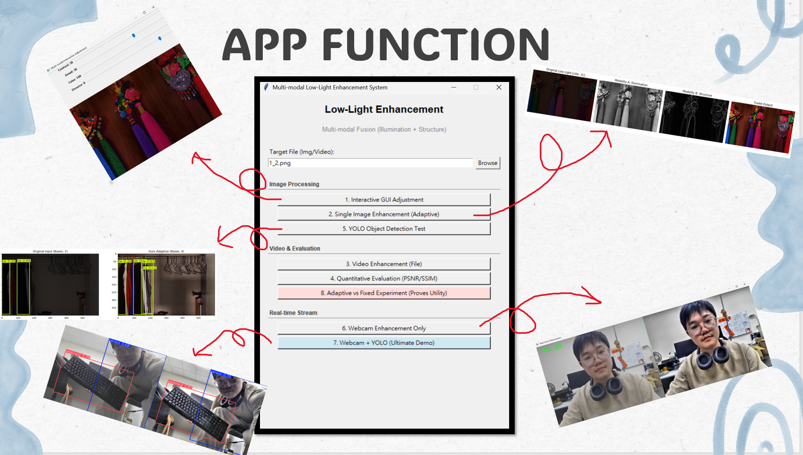
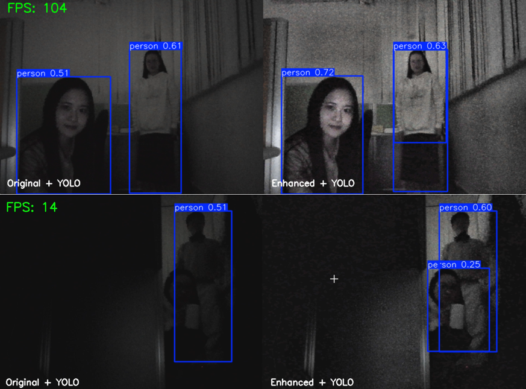

# Multi-Modality Image Processing (NYCU AI)

This repository contains two independent course projects:

- `final_project/`: Multi-modality low-light image enhancement system (Python, OpenCV, optional YOLO).
- `HW1/`: Homework 1 implementation (C + raylib, Windows executable included).

## Preview





## Repository Layout

```text
.
|-- final_project/
|-- HW1/
|   |-- src/
|   |-- data/
|   |-- docs/
|   |-- archives/
|   |-- raylib-5.5_win64_mingw-w64/
|   |-- main.exe
|-- README.md
|-- img/
|   |-- image1.png
|   |-- image2.png
|-- .gitignore
```

## 1) Final Project

Location: `final_project/`

Main features:

- Adaptive low-light enhancement (illumination + structure fusion)
- Interactive GUI adjustment
- Video enhancement and real-time webcam demo
- Optional YOLO comparison
- Quantitative evaluation (PSNR/SSIM)

Quick start:

```bash
cd final_project
pip install -r requirements.txt
python main.py
```

Standalone evaluation:

```bash
cd final_project
python evaluation.py
```

## 2) HW1

Location: `HW1/`

- Source code: `HW1/src/main.c`
- Input data: `HW1/data/`
- Documents: `HW1/docs/`
- Archived dataset: `HW1/archives/data.7z`
- Raylib runtime: `HW1/raylib-5.5_win64_mingw-w64/`
- Prebuilt executable: `HW1/main.exe`

Run on Windows:

1. Keep `main.exe`, `data/`, and `raylib-5.5_win64_mingw-w64/` in `HW1/`.
2. Double-click `HW1/main.exe`.

## Notes

- Each subproject keeps its own internal structure and dependencies.
- Generated files from the final project are ignored by default through `.gitignore`.